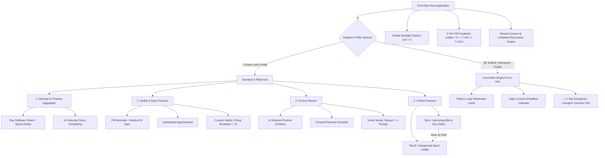

# OmniTask — Information Architecture & Design System Specification

> Complete, production-grade Information Architecture (IA), sitemap, comparison benchmarks, and interactive wireframe prototype for the OmniTask Website & Mobile App.

---

## 1. System Architecture Sitemap

OmniTask utilizes an **Adaptive Information Architecture** that bifurcates based on the user's cognitive and physical needs:



---

## 2. Industry Standard Comparison Benchmark

| Critical Dimension | Previous Draft Risk | Finalized Refined Architecture | Industry Status / Benchmark |
| :--- | :--- | :--- | :--- |
| **Cognitive Load for Seniors** | Complex tabs, dense layout, small touch targets, confusing AI menus. | **Adaptive Profile:** Isolates oversized 24pt+ medication cards, hides finance/fitness, adds instant 1-tap SOS caregiver contact. | **Exceeds WCAG AAA** accessibility guidelines. |
| **Financial Mental Model** | Upcoming bills isolated in Reminders, while past spend was in Expense. | **Unified Finances:** Bills & Ledger reside under one roof. Marking a bill "Paid" seamlessly logs it into the Spent Ledger. | Matches top fintech apps (*Mint, Copilot*). |
| **Calendar Usability & Psychology** | 8+ daily medications showed red "danger" alarm, inducing false panic for consistent patients. | **Sage $\rightarrow$ Blue $\rightarrow$ Violet progression**, keeping Royal Violet for full/productive days and reserving Red exclusively for missed doses. | Psychological design best practice. |
| **Task Ingestion Friction** | Risk of generic flat forms muddying data types. | **Module-First "+" Engine:** Enforces tailored schemas (Medical ID, billing frequency, habit emojis). | Clean relational database mapping. |
| **Caregiver Ethics & Autonomy** | Person being monitored had no independent exit if relationship broke down. | **Unilateral Emergency Revocation:** Monitored user can wipe caregiver access independently via SMS code or written statement. | Complies with modern patient-autonomy & privacy laws. |
| **Item Discovery** | Scoped search required checking multiple tabs to find an appointment or doctor payment. | **Hybrid Retrieval:** Scoped in-module filters plus a **Universal Spotlight (`Ctrl + K`)** search across all domains. | Desktop OS & modern productivity standard. |

---

## 3. Visual Density & Color Psychology Palette

The master calendar acts as a high-level cognitive cockpit:

| Task Density | Shape & Outline | Color Representation | Psychological Intent |
| :--- | :--- | :--- | :--- |
| **0 tasks** | Dashed outline, subtle radius | `Neutral Translucent` | Clean, open day. |
| **1–3 tasks** | Soft rounded corners (14px) | `Soft Sage Green` (`#4ade80`) | Light, easily manageable schedule. |
| **4–7 tasks** | Medium rounded corners (8px) | `Ocean Blue` (`#38bdf8`) | Active, balanced routine. |
| **8+ tasks** | Solid border, crisp corners | `Royal Violet` (`#c084fc`) | Full, highly productive schedule (No alarm). |
| **Missed Alert** | High-contrast flashing badge | `Crimson Red` (`#ef4444`) | **Strictly reserved for genuine emergencies** (Missed pill or overdue bill). |

---

## 4. Safety Escalation Protocol & Autonomy Engine

### 3-Stage Escalation Ladder for Critical Medications
1. **$T = 0$ (Scheduled Time):** Standard gentle chime & notification delivered to the user's personal device.
2. **$T + 5\text{ min}$:** Persistent high-volume alert with forced vibration on the user's device.
3. **$T + 12\text{ min}$ (Emergency Escalation):** Emergency distress push notification dispatched to the linked caregiver's device with full **Medical ID**, medication name, dosage, and last known status.

### Unilateral Autonomy Revocation
To prevent caregiver abuse and uphold user independence, the monitored individual can revoke access anytime via:
* **Option A (Routine):** Instant 6-digit one-time verification code sent to the caregiver's device.
* **Option B (Emergency Override):** Submitting a written statement through the interface. Access ends **immediately**, and all sensitive medical records are scrubbed from the caregiver's view.

---

## 5. Prototype Files in this Repository

| File | Purpose |
| :--- | :--- |
| [`index.html`](./index.html) | Interactive HTML wireframe prototype with live profile toggling, calendar density system, and modals. |
| [`style.css`](./style.css) | Complete design system tokens, dark-mode glassmorphism, accessibility utilities, and animations. |
| [`app.js`](./app.js) | Interactive state controller (Spotlight `Ctrl+K`, in-calendar scheduling, bill-to-ledger auto-link, streak penalty). |
| [`task-manager-app-full-conversation-record.md`](./task-manager-app-full-conversation-record.md) | Complete raw specification record behind all versions. |
| [`sync.bat`](./sync.bat) | 1-click script to stage, commit, and push updates to this GitHub repository. |

---

## 6. How to Run the Prototype Locally

Simply open `index.html` in any modern web browser, or launch via PowerShell:
```powershell
Start-Process .\index.html
```

* Keyboard Shortcut: Press **`Ctrl + K`** anywhere inside the prototype to test the Universal Spotlight Search.
