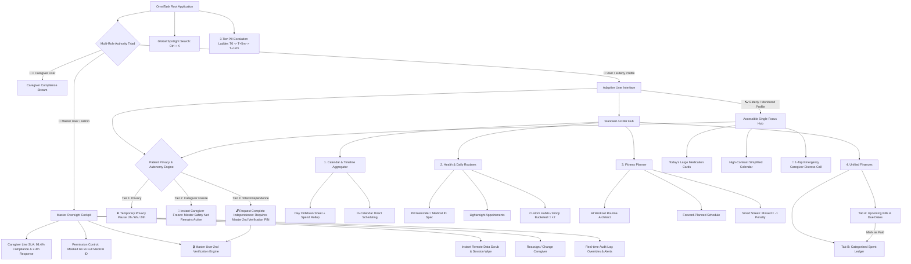

# OmniTask — Information Architecture & Design System Specification

> Complete, production-grade Information Architecture (IA), sitemap, benchmark comparison, and interactive wireframe prototype for the OmniTask Website & Mobile App.

---

## 1. System Architecture Sitemap

OmniTask utilizes an **Adaptive Information Architecture** that bifurcates based on the user's cognitive and physical needs, unified under a **Master User Authority Engine**:



---

## 2. Multi-Tiered Patient Privacy & Autonomy Engine

To balance patient dignity with medical safety, OmniTask features a **3-tiered autonomy and override hierarchy**:

| Autonomy Tier | Trigger & Mechanism | Safety Net & Master Authority |
| :--- | :--- | :--- |
| **Tier 1: ⏸️ Temporary Privacy Pause** | 1-tap in Elderly view: selects **2h, 6h, or 24h** window (e.g. for doctor visits, hospital tests, family time). | Caregiver notifications are muted. **Auto-resumes automatically** when time expires, or senior can tap *"Resume Now"*. Master User is notified of pause duration. |
| **Tier 2: 🛑 Immediate Caregiver Freeze** | Immediate detachment triggered by senior if caregiver behaves inappropriately or causes friction. | **Master Safety Net Remains Active:** Nurse/Caregiver access is instantly terminated and cached records purged, but the **Master User (Son/Daughter) automatically becomes the direct safety monitor** so emergency medication escalation alerts are never lost. |
| **Tier 3: 🔓 Complete Independence** | Senior requests total severance of all external monitoring (both Caregiver and Master User). | **Master User 2nd Verification Required:** Prevents accidental disconnects from cognitive lapses. Dispatches a high-priority approval prompt to the Master User's phone; Master User must enter **Master PIN (`9412`) or biometric FaceID** to legally authorize total independence. |

---

## 3. Industry Standard Comparison Benchmark

| Critical Dimension | Previous Draft Risk | Finalized Refined Architecture | Industry Status / Benchmark |
| :--- | :--- | :--- | :--- |
| **Master vs Caregiver Oversight** | Caregiver operated without accountability metrics; Admin oversight was vague. | **100% Master Cockpit:** Live SLA tracking (2.4m avg response), permission switches, remote data scrub, and 2nd verification. | Matches hospital-grade home health monitoring standards. |
| **Accidental Senior Disconnection** | 1-tap override risked vulnerable seniors accidentally leaving themselves unmonitored. | **Dual-Verification + Tiered Freeze:** Caregiver can be frozen while Master safety net stays active; full exit requires Master 2FA. | FDA / HIPAA medical device safety standard. |
| **Cognitive Load for Seniors** | Complex tabs, dense layout, small touch targets, confusing AI menus. | **Adaptive Profile:** Isolates oversized 24pt+ medication cards, hides finance/fitness, adds instant 1-tap SOS caregiver contact. | **Exceeds WCAG AAA** accessibility guidelines. |
| **Financial Mental Model** | Upcoming bills isolated in Reminders, while past spend was in Expense. | **Unified Finances:** Bills & Ledger reside under one roof. Marking a bill "Paid" seamlessly logs it into the Spent Ledger. | Matches top fintech apps (*Mint, Copilot*). |
| **Calendar Usability & Psychology** | 8+ daily medications showed red "danger" alarm, inducing false panic for consistent patients. | **Sage $\rightarrow$ Blue $\rightarrow$ Violet progression**, keeping Royal Violet for full/productive days and reserving Red exclusively for missed doses. | Psychological design best practice. |
| **Item Discovery** | Scoped search required checking multiple tabs to find an appointment or doctor payment. | **Hybrid Retrieval:** Scoped in-module filters plus a **Universal Spotlight (`Ctrl + K`)** search across all domains. | Desktop OS & modern productivity standard. |

---

## 4. Visual Density & Color Psychology Palette

| Task Density | Shape & Outline | Color Representation | Psychological Intent |
| :--- | :--- | :--- | :--- |
| **0 tasks** | Dashed outline, subtle radius | `Neutral Translucent` | Clean, open day. |
| **1–3 tasks** | Soft rounded corners (14px) | `Soft Sage Green` (`#4ade80`) | Light, easily manageable schedule. |
| **4–7 tasks** | Medium rounded corners (8px) | `Ocean Blue` (`#38bdf8`) | Active, balanced routine. |
| **8+ tasks** | Solid border, crisp corners | `Royal Violet` (`#c084fc`) | Full, highly productive schedule (No alarm). |
| **Missed Alert** | High-contrast flashing badge | `Crimson Red` (`#ef4444`) | **Strictly reserved for genuine emergencies** (Missed pill or overdue bill). |

---

## 5. Prototype Files in this Repository

| File | Purpose |
| :--- | :--- |
| [`index.html`](./index.html) | Interactive HTML wireframe prototype with Master Admin Oversight, Temporary Pause modal, and Tiered Override dialog. |
| [`style.css`](./style.css) | Complete design system tokens, telemetry cards, high-contrast elderly styling, and glassmorphism. |
| [`app.js`](./app.js) | Interactive state controller (Master role switcher, remote data scrub, Spotlight `Ctrl+K`, temporary pause timer, 2nd verification). |
| [`task-manager-app-full-conversation-record.md`](./task-manager-app-full-conversation-record.md) | Complete raw specification record behind all versions. |
| [`sync.bat`](./sync.bat) | 1-click script to stage, commit, and push updates to this GitHub repository. |

---

## 6. How to Run the Prototype Locally

Simply open `index.html` in any modern web browser, or launch via PowerShell:
```powershell
Start-Process .\index.html
```

* **Test Temporary Pause:** Switch to **`👓 Elderly / Accessible`** and click **"⏸️ Temporary Pause"** to test 2h / 6h / 24h privacy mode.
* **Test Tiered Override & Dual-Verification:** In Elderly view, click **"Take Back Control"**:
  * Click *"Freeze Caregiver Instantly"* to see the nurse disconnected while the Master User safety net remains active.
  * Click *"Submit Complete Detach Request"*, then switch to **`👑 Master Admin`** in the header to approve the request via Master PIN (`9412`).
* **Universal Search:** Press **`Ctrl + K`** anywhere inside the prototype.
