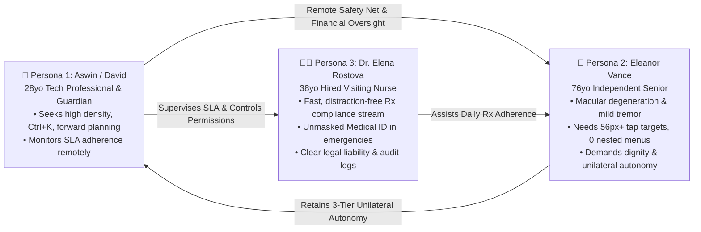
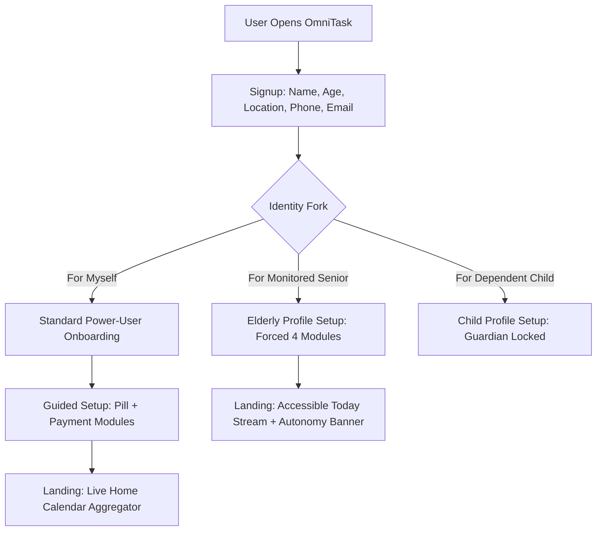
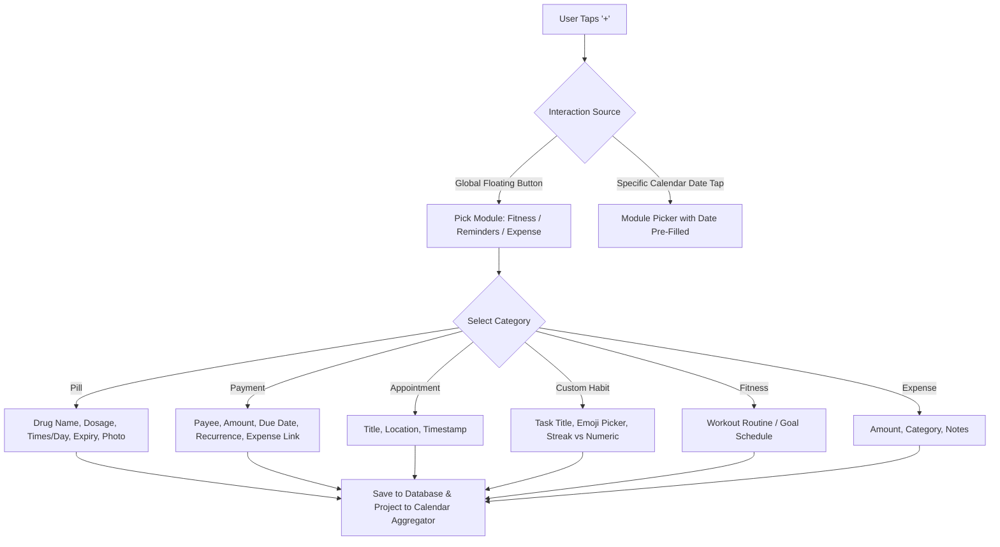
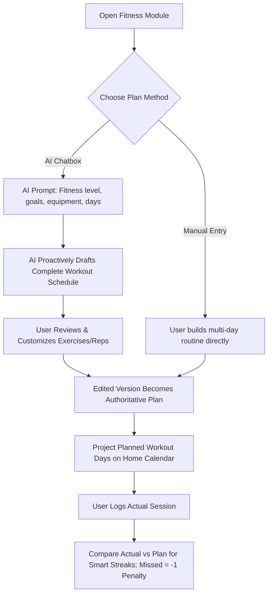
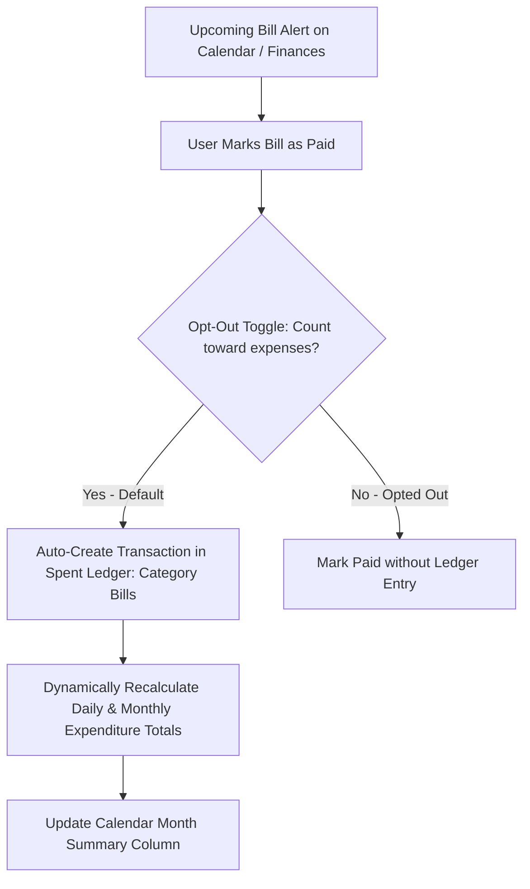
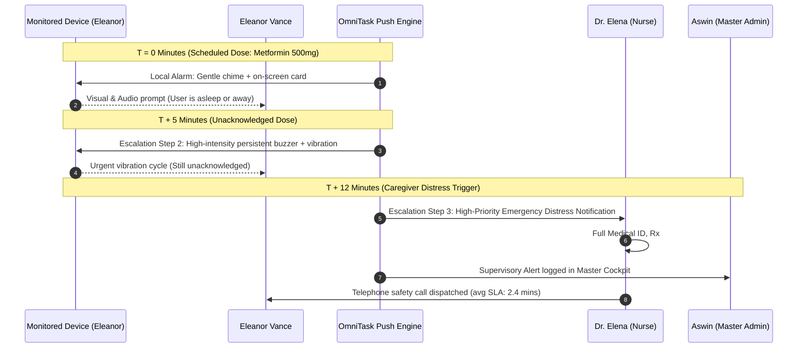
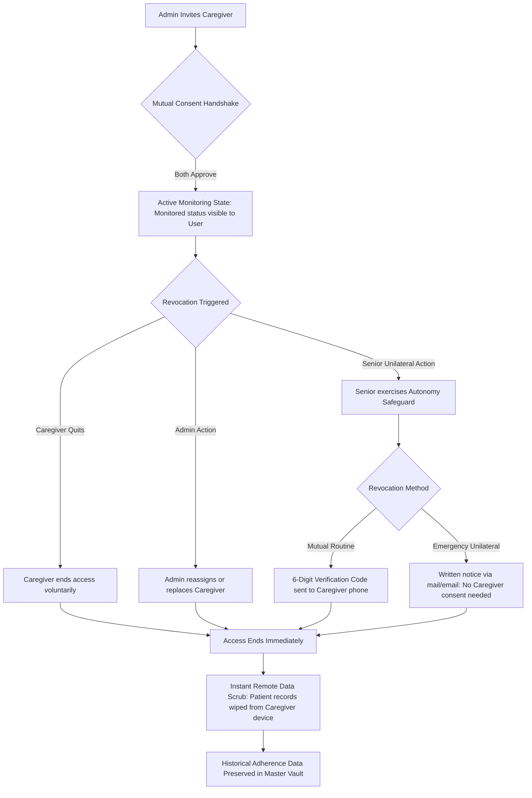

# OmniTask — UX Research Synthesis & Architectural Blueprint

> **Executive Product Design Document**  
> **Course / Institution:** National Institute of Fashion Technology (NIFT) — Department of Design  
> **Subject:** Advanced UX Research, Information Architecture & Cognitive Accessibility  
> **Author:** Aswin (`aswin_bd_24_602`)  
> **Version:** 2.1 (Comprehensive Research Synthesis & Flow Matrix)  
> **Date:** October 2026  

---

## 1. Executive Summary & Design Vision

**OmniTask** addresses the cognitive fragmentation of modern personal productivity. Contemporary digital life forces users across separate, disconnected silos:
- Calendar tools (*Google Calendar, Apple Calendar*) focus on temporal appointments but completely ignore medication regimens, medical ID needs, and daily habits.
- Health apps (*Medisafe, MyTherapy*) operate in isolation, treating seniors with clinical coldness or stripping them of dignity.
- Budgeting applications (*Copilot, Mint*) record expenses retrospectively, detaching upcoming bills from the daily schedule.

### The Core Design Challenge
How might we design a **calendar-centric personal operating system** where the Home calendar serves as a **live, pure aggregator and preview layer** (never the data owner), feeding from four dedicated life domains: **Fitness, Reminders (Pill / Payment / Appointment / Custom), and Expense**, while dynamically balancing:
1. **The Tech-Savvy Guardian & Multitasker:** Demanding rapid keyboard shortcuts (`Ctrl + K`), high information density, and predictive planning.
2. **The Aging Senior (76+):** Coping with macular degeneration, mild hand tremors, polypharmacy management, and cognitive fatigue.
3. **The Remote Caregiver / Medical Specialist:** Requiring real-time SLA compliance, emergency escalation telemetry, and zero distraction.

---

## 2. User Archetypes & Relational Mental Models

### 2.1 Persona Matrix

| Dimension | Persona 1: The Master Guardian (Aswin) | Persona 2: The Independent Senior (Eleanor) | Persona 3: The Clinical Caregiver (Dr. Elena) |
| :--- | :--- | :--- | :--- |
| **Age & Role** | 28 • Product Consultant & Primary Family Guardian | 76 • Retired Literature Teacher living alone | 38 • Registered Home Care Nurse (RN/MD) |
| **Physical & Cognitive Context** | High digital literacy; multi-device multitasker; prone to notification fatigue. | Age-related macular degeneration; mild essential tremor; polypharmacy regimen (3 daily Rx). | Highly trained; manages 8 seniors across district; needs high-signal, zero-noise data. |
| **Primary Goal** | Single dashboard for workouts, bills, meetings + passive safety net for his mother. | Maintain independent living; take correct pills on time without feeling infantilized. | Verify medication adherence in real time; access unmasked Medical ID in emergencies. |
| **Key Pain Point** | Constant anxiety about his mother; frustrated by app switching (Splitwise, Medisafe, Strong). | Small mobile buttons; confusing nested menus; humiliation from surveillance software. | Cluttered consumer apps; ambiguous liability when patients self-report doses. |

---

## 3. The 5 Core UX Design Tensions & Architectural Resolutions

### Tension 1: High Density vs. Senior Cognitive Load
* **The Conflict:** Power users require a comprehensive 7-column month matrix and quick shortcuts. Seniors facing cognitive fatigue get paralyzed by visual noise.
* **Resolution (Adaptive Mode Switcher):**
  * **Standard Power-User Mode:** 4-Pillar Hub (*Calendar, Health/Routines, Fitness, Finances*), month density heatmap, `Ctrl + K` Universal Spotlight.
  * **Senior Accessible Mode:** Single-stream chronological feed of today's schedule, oversized cards (56px+), zero swipe gestures, and prominent 1-tap SOS distress button.

### Tension 2: Safety Oversight vs. Patient Dignity & Autonomy
* **The Conflict:** Family monitoring often becomes a one-way surveillance trap, stripping seniors of agency.
* **Resolution (3-Tier Autonomy Engine):**
  * **Tier 1 (Temporary Privacy Pause):** Senior can pause monitoring for 2h, 6h, or 24h for social events or personal appointments. Resumes automatically or manually.
  * **Tier 2 (Caregiver Freeze):** Unilateral one-tap detachment if caregiver causes friction. Cached records are immediately scrubbed from the nurse's device, but the **Master Guardian safety net remains active**.
  * **Tier 3 (Complete Independence):** Dispatches high-priority authorization to Master User, requiring **Master PIN (`9412`) or biometric FaceID** to prevent accidental disconnection.

### Tension 3: Cognitive Color Psychology & Accessibility
* **The Conflict:** Standard heatmaps display heavy task days (8+ tasks) in bright red. In clinical testing, red cells caused seniors intense anxiety ("Did I do something wrong?").
* **Resolution (Harmonious Chromatic Progression & Edge Geometry):**
  * `0 tasks`: Neutral / Translucent.
  * `1–4 tasks`: **Sage Green** (`#4ade80`) with soft, rounded corners.
  * `5–7 tasks`: **Ocean Blue** (`#38bdf8`) with medium corners.
  * `8+ tasks`: **Royal Violet** (`#c084fc`) with sharp corners (celebrating a productive day).
  * **Crimson Red (`#f87171`)** is strictly isolated for emergency escalations and missed medication alerts.
  * Corner geometry provides a non-color accessibility channel for color-blind users (WCAG 2.2 AAA).

### Tension 4: Bi-Directional Financial Mental Model
* **The Conflict:** Users resist double entry—marking a bill paid in a reminder app, then recording an expense in a ledger app.
* **Resolution (Payment ↔ Expense Auto-Link):**
  * Marking an upcoming utility bill "Paid" automatically creates a categorized transaction in the **Spent Ledger** under `Bills/Utilities`.
  * Per-payment opt-out toggle ("Count toward my expenses?") for payments made on others' behalf.
  * Both paid and unpaid committed bills calculate dynamically in the monthly projection.

### Tension 5: Risk-Weighted Onboarding Architecture
* **The Conflict:** Mandatory long onboarding causes drop-offs, while skipping onboarding leads to system underutilization.
* **Resolution (Risk-Based Graduation):**
  * **Standard Users:** Must configure the 2 highest-consequence modules (**Pill + Payment**) before skip unlocks.
  * **Users 45+ / Senior Profiles:** Guided through all 4 modules, offering a choice between **live data entry** and **interactive demo videos**.

---

## 4. The 6 End-to-End System Flows (v4 Spec)

### Flow 1: App Entry & Identity Routing

### Flow 2: Add-Entry Flow (Module-First Architecture)

### Flow 3: Fitness Plan Creation & Reconciliation Flow

### Flow 4: Payment to Expense Link Flow

### Flow 5: Missed Pill Escalation Ladder

### Flow 6: Caregiver Access & Revocation Lifecycle

---

## 5. Accessibility Engineering & Ergonomics (WCAG 2.2 AAA)

* **Contrast Ratios:** Exceeds AAA standards across all views (e.g. Body text on obsidian background = **18.4 : 1**; emergency red on obsidian = **7.5 : 1**).
* **Motor Tremor Safeguards:** Minimum touch targets of **$56 \times 56\text{dp}$** on all senior interactive controls, surrounded by a 16px protective margin to prevent double-tap misclicks.
* **Zero Gestural Dependency:** No drag-and-drop, pinch-to-zoom, or swipe-to-delete required. Every action can be completed with a deliberate single tap.
* **Custom Appearance Controls:** In-app settings to customize typeface, text size, and contrast mode.

---

## 6. Implementation Readiness for Clean Canvas (`index.html`)

With the Information Architecture, Personas, and System Flows fully codified, the clean canvas in [`index.html`](file:///c:/Users/aswin/OneDrive/Desktop/uiux%20app/index.html), [`style.css`](file:///c:/Users/aswin/OneDrive/Desktop/uiux%20app/style.css), and [`app.js`](file:///c:/Users/aswin/OneDrive/Desktop/uiux%20app/app.js) is ready for interactive prototyping:
1. **Interactive Calendar Density Matrix:** Rendering monthly dates with Sage/Ocean/Violet density tokens and edge geometries.
2. **Adaptive Mode Switcher:** Immediate toggling between the 4-Pillar Power-User view and the 56px Senior accessible view.
3. **Interactive 6-Flow Simulators:** Clickable simulations of the `+` Module-First Ingestion Modal, the T+12m Escalation Ladder, and the 3-Tier Autonomy Engine.
