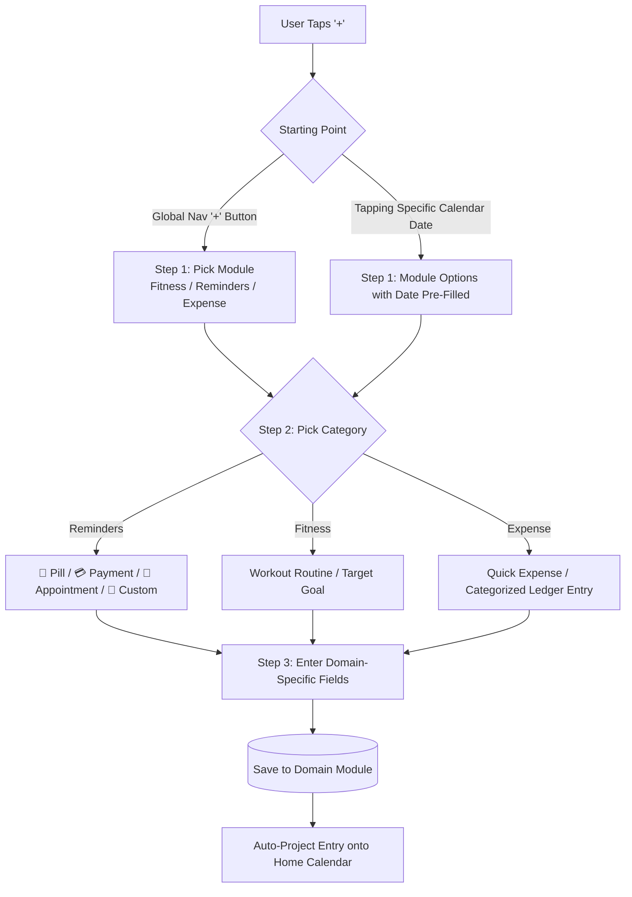
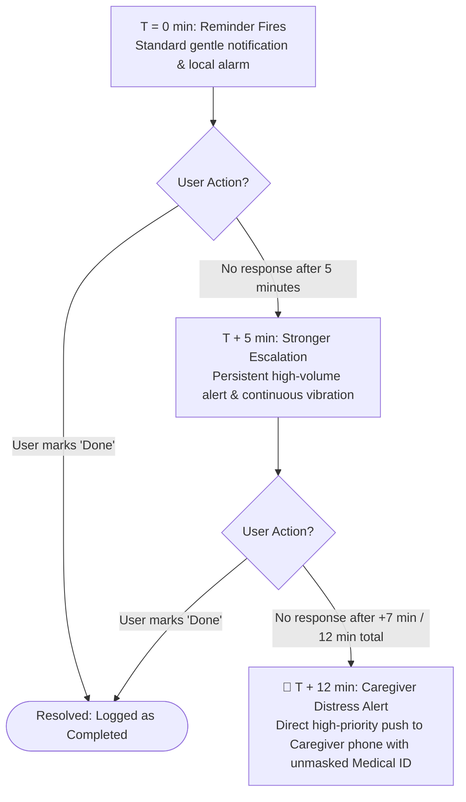
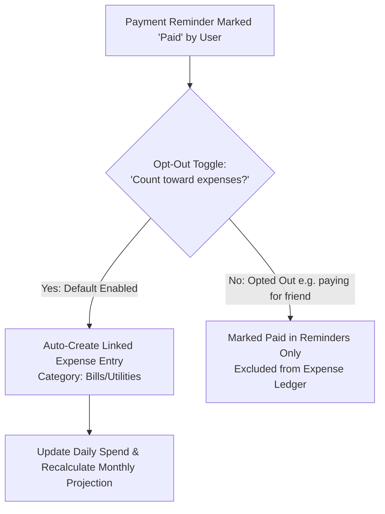
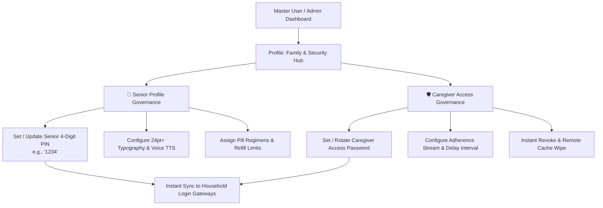
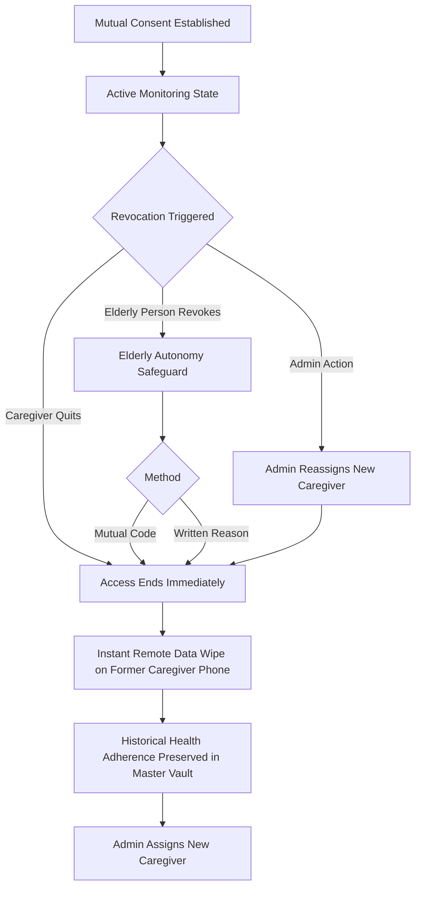
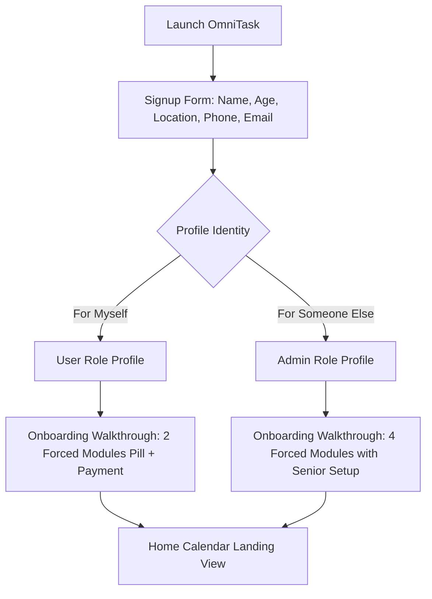
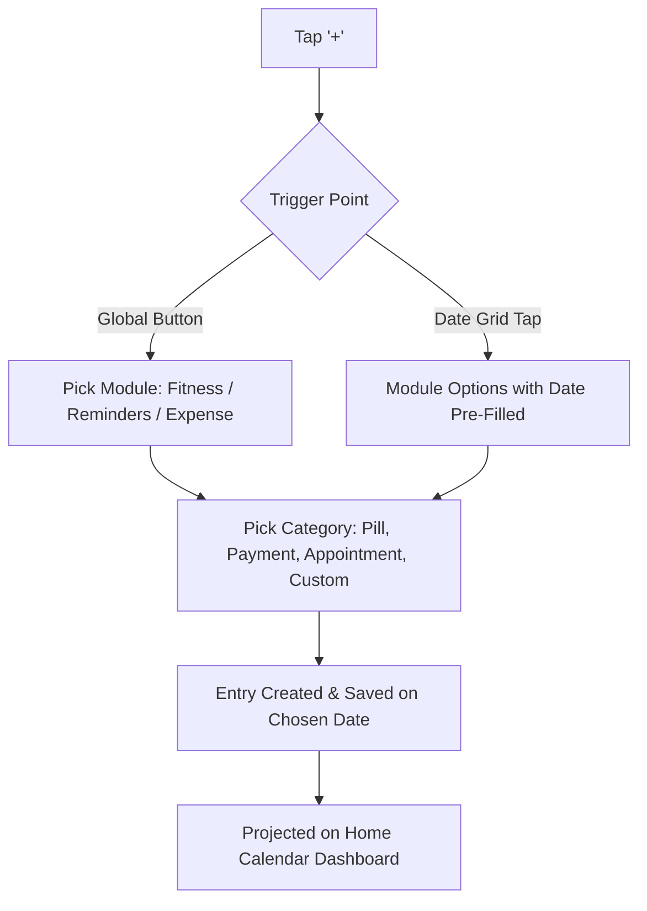
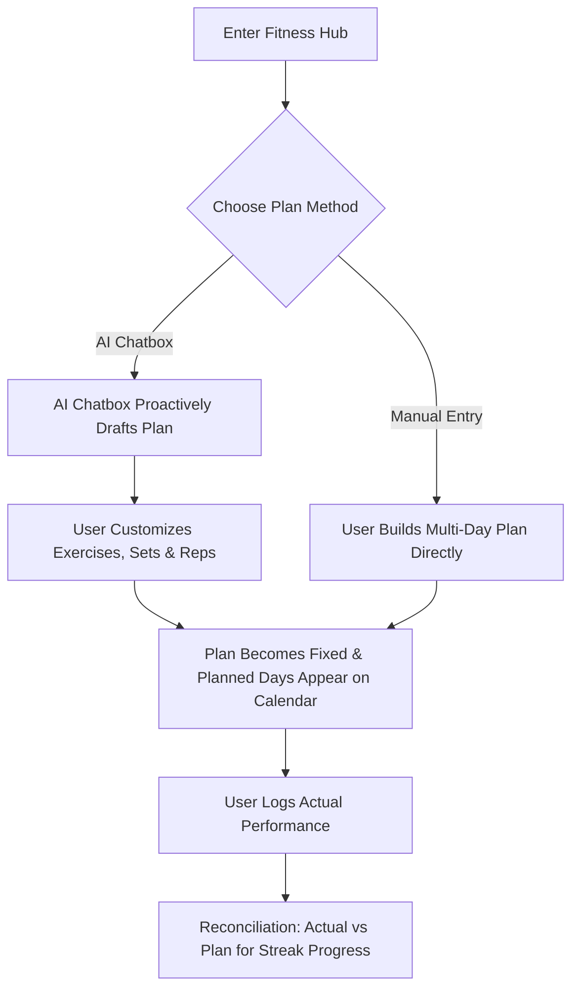
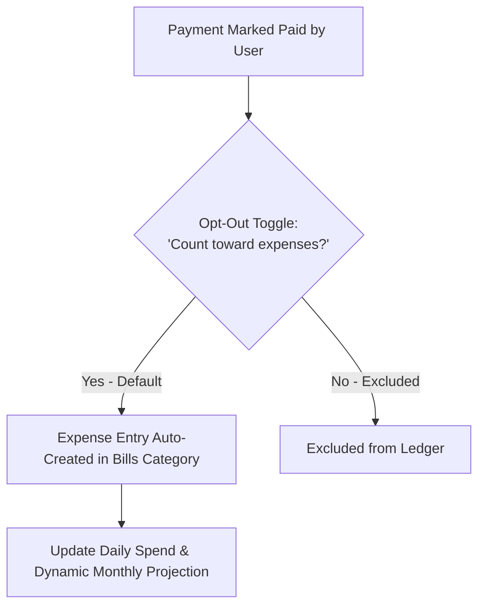

# OmniTask — Complete Information Architecture Specification (Master v4.4)

> **Document Type:** Master Information Architecture (IA) Specification & System Blueprint  
> **Project:** OmniTask (Task Manager App) — Calendar-Centric Life Dashboard  
> **Prepared for:** Aswin (`aswin_bd_24_602`)  
> **Version:** 4.4 (Master Edition with Pill Course Tracker, Auto-Link Budgeting, Smart Streaks & Anti-Vulnerability Safeguards)  
> **Associated Visual PDFs:** [`pdfs/task-manager-app-ia-spec-v4.pdf`](pdfs/task-manager-app-ia-spec-v4.pdf) | [`pdfs/task-manager-app-ia-spec-v3.pdf`](pdfs/task-manager-app-ia-spec-v3.pdf)  

---

## 1. Core Concept & Fundamental Premise

OmniTask is a **calendar-centric personal operating system and task manager**. The core structural decision governing the application is:

> **The Home calendar is strictly an aggregator and preview layer — it never owns, stores, or duplicates underlying domain data.**

Four independent life-domain modules feed structured events into this aggregation engine:
1. **Fitness:** Structured workout routines, goals, and smart streaks.
2. **Reminders:** Pill / Medical ID & Course Tracker, Payment / Bills, Appointments, and Custom Emoji Habits.
3. **Expense:** Categorized spending ledger, budget breakdowns, and monthly projections.
4. **Home (Calendar Dashboard):** Live timeline, density heatmaps, and cross-domain previews.

---

## 2. Navigation Architecture

OmniTask uses a persistent **4-tab bottom navigation** system:

| Tab | Icon | Domain Role & Underlying Data Model |
| :--- | :---: | :--- |
| **Home** | 📅 | **Calendar Aggregator:** Live month grid, date inspection, density heatmaps, and financial summaries. |
| **Fitness** | 🏋️ | **Physical Health:** Workout logs (retrospective), goals (prospective), and AI plan generation. |
| **Reminders** | 🔔 | **Schedule & Health Compliance:** Grouped hub for Pill 💊, Payment 💳, Appointment 📅, and Custom 🔔 items. |
| **Expense** | 💳 | **Financial Management:** Categorized spending ledger rolling up into daily, weekly, and monthly totals. |

### Rationale: Principle of Choices & Cognitive Chunking
Rather than fragmenting navigation into 5+ cluttered tabs (e.g. separate tabs for Pills, Bills, Appointments, Fitness, Calendar), **Pill and Payment reminders are structurally unified under Reminders**. Both share the exact same underlying object architecture:
$$\text{Task Object} = \{\text{Title}, \text{Due Date / Timestamp}, \text{Recurrence Rule}, \text{Mark-Done State}\}$$
Merging them keeps the global navigation clean and uncluttered (Hick's Law), while **domain-specific icons preserve visual distinctness**.

---

## 3. The "+" Add Flow (Module-First Hierarchy)

To eliminate decision fatigue and avoid a flat, overwhelming list of 15+ disparate items, the ingestion workflow is strictly **module-first**:

* **Never a flat list:** Users never see all subcategories at once without selecting the life domain first.
* **Date Pre-population:** Tapping October 18 on the calendar directly opens the module selector with `date = 2026-10-18` already locked in.

---

## 4. Reminders Module (Domain Breakdown)

### 4.1 Pill Reminder (Medical ID & Course Progression Engine) 💊
* **Fields:** Drug Name, Exact Dosage Strength, Schedule (times/day), Regimen Type, Course Duration (Days), Doses Completed, Expiration Date, Prescription Number, Prescribing Doctor, and Physical Pill Photo.
* **Course Progression & Adherence Tracker (v4.2):**
  * **Regimen Classification:**
    * *Fixed Course:* Temporary medications with a strict end-date (e.g., 7-day antibiotic, 14-day steroid taper, 30-day acute treatment).
    * *Chronic / Ongoing:* Continuous daily medication with recurring refill intervals (e.g., 30-day, 60-day, 90-day bottle cycles).
  * **Visual Progress Representation:**
    * A dynamic linear progress bar displaying `Day X of Y Completed (Z%)` and `N Days Remaining`.
    * Senior High-Contrast View: Prominent visual counters (e.g., `🟢 18 DAYS TAKEN • ⚪ 12 DAYS LEFT`).
  * **Smart Refill Countdown & Alerts:**
    * Proactive warning notification triggers when $\le 5\text{ days}$ (or $\le 15\%$) of doses remain: *"⚠️ Refill needed in 4 days — Tap to call pharmacy or request Rx renewal"*.
  * **Course Completion Protocol:**
    * Upon logging the final dose ($30/30\text{ days}$), the system celebrates completion (`🎉 Course Completed!`) and prompts the user to either auto-archive the medication or schedule a follow-up physician appointment.
* **Medical ID Functionality:** Acts as an exportable/showable Medical ID card that elderly users or caregivers can hand to doctors or emergency pharmacists.
* **Caregiver Telemetry Adherence Score:** Real-time calculation streamed to linked guardians:
  $$\text{Adherence Rate} = \left(\frac{\text{Doses Taken On Time}}{\text{Total Scheduled Doses}}\right) \times 100\%$$
* **Scope Definition:**
  * **MVP:** Manual entry only with course duration and progress engine.
  * **Deferred (v2):** External drug database auto-lookup by name or camera barcode scan (requires external pharmacology database integration).

### 4.2 Payment / Bill Reminder 💳
* **Fields:** Payee Name, Amount ($), Due Date, Recurrence Flag.
* **Expense Integration:** Marking a payment "paid" automatically creates a corresponding transaction in the Expense module under `Bills/Utilities` (see Section 6).

### 4.3 Appointment 📅
* **Fields:** Title, Location / Room, Timestamp.
* **Design Philosophy:** Kept deliberately minimal to prevent cognitive bloat. Avoids redundant external map links or complex fields in v1.

### 4.4 Custom Category & Emoji Grouping Rules 🔔
* **Representation:** Freeform task where the user selects any emoji from their device's native keyboard as the category signifier (e.g. 🎸 Guitar, 📚 Reading, 💧 Water).
* **Same-Day Clustering Rule:** Reusing the same emoji on the same date **does not create duplicate clutter rows**. Instead, tasks group under that emoji's "bucket" for that date:
  * Calendar cell displays: `🎸 ×3`
  * Tapping the cell expands the cluster, showing individual timestamps (e.g., `09:00 AM • Scale practice`, `02:00 PM • Song study`, `07:00 PM • Jam session`).
* **Tracking Modes:** Chosen per-item at creation:
  1. *Streak / Checklist:* Binary completion (Did I do it today? Yes/No).
  2. *Numeric Progress:* Quantitative duration or volume (e.g., 45 minutes, 2.5 liters).

### 4.5 Module-Specific Timing & Recurrence Engine
Notification frequencies are tailored to the physiological and behavioral realities of each domain:
* **Pill:** *Times-per-day* frequency picker (e.g., 1x morning, 2x with meals, 3x every 8 hours).
* **Payment:** *Days-before-due* notification picker (e.g., 7 days before, 3 days before, day of).
* **Fitness / Custom:** Exact single *time picker* (e.g., 07:30 AM).
* **Recurrence Patterns:** Offers instant quick presets (*Next day, 2 days after, 3 days after, Same day next week, Same day next month*) plus full custom flexibility for irregular recurring schedules.

### 4.6 Missed / Overdue Escalation Ladder (Fig 1)
Designed to safeguard elderly users with polypharmacy regimens:
* **Default State:** Loud by default (opt-out toggle available per user).
* **Caregiver Telemetry:** Missed doses remain permanently visible on the linked Caregiver feed until resolved.

---

## 5. Fitness Module

### 5.1 Object Duality
1. **Workout Log (Retrospective):** Records completed physical activity ("I did this today").
2. **Goal (Prospective):** Establishes upcoming targets ("I aim to workout 4 days this week"). Goals proactively drive the Home calendar forward—planned workout days populate future calendar cells.

### 5.2 Plan Creation Paths
1. **AI-Assisted Chatbox:** Proactively gathers fitness level, primary goal, available equipment, and weekly schedule. Generates a tailored workout routine. *(Diet and meal planning were evaluated and explicitly removed from scope to maintain fitness focus).*
2. **Manual Builder:** User creates a custom multi-day routine directly from scratch.

### 5.3 Plan vs. Actual Reconciliation Engine
* If a user modifies an AI-drafted workout routine, the **user-edited version becomes the authoritative plan**.
* Actual logged workout metrics are reconciled against that customized plan.
* **Smart Streaks:** Missing a scheduled workout penalizes the streak by **1 unit only** instead of an aggressive, demotivating reset to zero.
* *Deferred (v2):* Apple HealthKit / Google Fit / wearable step-counter synchronization.

---

## 6. Expense Module & Unified Financial Model

### 6.1 Categorized Spending Ledger
Standard expense categories: **Food, Transport, Bills/Utilities, Shopping, Health, Other**.

### 6.2 Calendar Financial Rollup
* **Daily Inspection:** Tapping any date on the Home calendar displays that day's total expenditure calculated from ledger entries.
* **Monthly Summary Column:** An end-of-month breakdown section calculates weekly totals (e.g., Days 1–7 spend, Days 8–14 spend) and total monthly outlay.

### 6.3 Payment ↔ Expense Auto-Linking Flow (Fig 6)
To eliminate duplicate bookkeeping:

* **Committed Spend Projection:** Both paid and unpaid upcoming bills factor into the monthly financial forecast (visually distinguished using solid vs. outlined styling).

---

## 7. Home Calendar Visual System

### 7.1 Month View Default & Density System
The month grid is the primary landing interface. To prevent visual overload, cells remain completely clean: **no text numbers or icons clutter the grid**.

Busyness is communicated via an accessible **Density & Shape Matrix**:

| Task Count | Cell Color | Edge Geometry | Accessibility / Psychological Intent |
| :---: | :---: | :---: | :--- |
| **0 tasks** | Translucent / Neutral | — | Restful, zero cognitive demand. |
| **1–4 tasks** | **Sage Green** (`#4ade80`) | Soft, rounded corners | Calm, manageable daily load. |
| **5–7 tasks** | **Ocean Blue** (`#38bdf8`) | Medium-rounded corners | Active, productive day. |
| **8+ tasks** | **Royal Violet** (`#c084fc`) | Sharp, crisp corners | High accomplishment (Replaces anxiety-inducing red). |
| **Emergency** | **Crimson Red** (`#f87171`) | Pulsing outline | Strictly reserved for missed medications or overdue bills. |

* **Non-Color Accessibility Channel:** Edge roughness/curvature varies alongside color so color-blind users can instantly distinguish density levels (WCAG 2.2 AAA compliant).

---

## 8. Onboarding & Account Segmentation Architecture

### 8.1 Data Collection at Signup
Registration captures: Name, Age, Location Permission, Phone Number, and Email.

### 8.2 Risk-Weighted Guided Setup
* **Standard Profiles (<45 years):** Forced through setup of the **2 highest-consequence modules (Pill + Payment)** before a skip button appears.
* **Elderly Profiles (45+ years):** Forced through all **4 modules** to guarantee comprehension of high-value safety features.
* **Setup Paths:** Distinct onboarding paths for:
  1. *"For myself"* (Standard Power-User).
  2. *"For an elderly person"* (Caregiver/Admin setting up a senior).
  3. *"For a child"* (Parental oversight).
* **Dual Modality:** Walkthrough offers a choice between **live data entry** or watching an **interactive demo video**.

---

## 9. App Multi-Role Architecture (Master User / Senior / Caregiver)

| Role | Definition & Authority Boundary | Credential & Governance Rules |
| :--- | :--- | :--- |
| **Master User (Power User / Admin)** | The primary account holder and household administrator (e.g., Aswin). Full administrative control over household profiles, modules, billing, and settings. | **Authority to provision & manage credentials for all sub-profiles.** Sets and resets the Senior's 4-digit PIN, configures Caregiver access codes, and sets escalation delays. |
| **Senior User (Elderly Profile)** | Dependent or semi-independent aging adult (e.g., Eleanor Vance) operating in Senior Shield Mode (high-contrast AAA, 24pt+ bold text, 56dp oversized touch targets). | **Simplified 4-Digit PIN (e.g., `1234`).** Configured and managed by the Master User so the senior is never locked out by complex passwords or 2FA friction. |
| **Caregiver** | An assigned monitor (e.g., adult child, visiting nurse John Vance) receiving real-time adherence telemetry and escalation ladder notifications. | **Caregiver Access Password / Invite Token.** Provisioned by Master User with configurable permission scopes (View-Only Telemetry vs Emergency Intervention). |

### 9.1 Master User Family & Security Hub (PIN & Credential Provisioning)
To prevent vulnerable seniors with cognitive decline or mild memory impairment from suffering password lockouts or onboarding friction:
1. **Master PIN Provisioning:** The Master User sets and edits the Senior's 4-digit PIN directly from the **Profile > Family & Security Hub**.
2. **Instant Household Sync:** Changing the PIN in the Master User's dashboard instantly updates authentication records across all shared household devices without requiring the senior to perform verification steps.
3. **Emergency Override:** If the senior forgets their PIN, the Master User can unlock the device remotely or generate a single-use 4-digit temporary bypass.
4. **Caregiver Token Rotation:** The Master User can rotate caregiver access passwords or revoke monitoring permissions in 1 click, immediately triggering a remote data scrub on the caregiver's device.

---

## 10. Caregiver Monitoring & Autonomy Safeguards

### 10.1 Consent & Transparency
* **Mutual Consent:** Monitoring can never be started unilaterally. Both the User and the Caregiver must confirm the connection.
* **Full Medical Visibility:** The Caregiver has full access to medication names, strengths, prescription numbers, and expiry dates (not just high-level status dots).
* **No Silent Surveillance:** Monitored users always see a persistent visual indicator on their dashboard confirming active caregiver telemetry.

### 10.2 Revocation, Teardown & Autonomy Engine (Fig 2)
To protect elderly dignity and prevent entrapment:
* **Caregiver Revocation:** Caregivers can detach at any time.
* **Senior Unilateral Autonomy:** The senior can revoke access independently through two paths:
  1. *Mutual Routine Path:* 6-digit verification code sent to caregiver's device.
  2. *Emergency Unilateral Path:* Written reason submitted via email/mail—bypasses caregiver approval completely.
* **Child Rule:** Child profiles under 18 cannot revoke parental access; individuals 18+ can revoke independently.
* **Instant Remote Scrub:** When access is terminated, all cached patient data is immediately wiped from the caregiver's device with zero lingering historical access.

---

## 11. Offline Resilience & Timezone Governance

### 11.1 Local-First Architecture
* All scheduled alarms, pill reminders, and Medical ID records live **locally on the user's device storage**. Reminders fire accurately without any internet connection.
* **Instant Offline Telemetry:** When a monitored device disconnects, the backend sends an **immediate real-time alert** to the Caregiver's phone ("Eleanor's device is currently offline") rather than waiting for reconnection.
* On reconnection, all queued adherence logs sync immediately.

### 11.2 Timezone Decoupling
* Reminders and escalation intervals run strictly on the **monitored User's local timezone**.
* The Caregiver's app displays translated timestamps to avoid confusion when monitoring relatives across time zones.

---

## 12. Full App Flow Diagrams (Master Section 16)

### Flow 1: Entry Flow — Signup to Home (Fig 3)

### Flow 2: Add-Entry Flow — Any Module, Any Entry Point (Fig 4)

### Flow 3: Fitness Plan Flow (Fig 5)

### Flow 4: Payment to Expense Link Flow (Fig 6)

---

## 13. System Additions & Enhancements (v4.4)

1. **Scoped Search Engine:** Search is implemented locally inside each respective module (*Search Pills, Search Expenses, Search Workouts*) in addition to global spotlight retrieval (`Ctrl + K`).
2. **Smart Streaks:** Missing a routine reduces streak progress by **1 unit** rather than resetting to zero.
3. **Typography & Appearance Settings:** Complete settings panel for custom text color, typeface selection, and font-size scaling.
4. **Prescription Course & Refill Countdown Engine (v4.2):** Visual linear progress bar (`Day X of Y • Z%`), adherence rate telemetry for caregivers, smart $\le 5\text{-day}$ refill warnings, and celebratory completion protocols.
5. **Universal Edit, Rewrite & Cascade Synchronization (v4.3):** Retroactive historical editing, cascade sync between linked bills and expense ledger, and `Ctrl+Z` / `Ctrl+Y` undo engine.
6. **Anti-Vulnerability Safeguards & Guardrails (v4.4):** Speed-Dial 2-field ingestion, Senior Shield sandbox isolation, explicit dual-scope cascade edit selectors, and Senior Privacy Pause protocols.
7. **Multilingual AI Voice Assistant (v2):** Speech recognition and conversational interface planned for future release.

---

## 14. Anti-Vulnerability & Usability Safeguards (v4.4 Master)

| Potential Trap / Vulnerability | Rectified System Protocol (v4.4) |
| :--- | :--- |
| **Ingestion Modal Bloat** | **Speed-Dial 2-Field Add:** Mandatory minimum is strictly Name & Schedule/Amount. Advanced fields (Rx#, doctor, pill photo, refill days) tuck into a single collapsible progressive drawer with intelligent smart defaults. |
| **Senior Cognitive Overload** | **Senior Shield Sandbox:** Completely isolates seniors from dense spreadsheets, complex streak math, or 4-column splits. Replaces with a single-stream high-contrast feed ($24\text{pt}+$, $56\text{dp}$ touch buttons, TTS voice read-outs). |
| **Cascade Sync Ambiguity** | **Visual Impact Preview:** When editing an auto-linked bill/expense, displays an explicit dual-scope choice (*"Update Both"* vs *"Update Bill Only"*) with a 5-second floating Undo safety toast. |
| **Caregiver Surveillance Friction** | **Senior Privacy Pause:** Monitored users can activate a 1-hour or 4-hour telemetry pause for personal dignity, while emergency distress alarms remain permanently active. |

---

## 15. Consolidated Deferred Scope (v2 Roadmap)

| Deferred Feature | Architectural Rationale |
| :--- | :--- |
| **Drug Database Auto-Lookup & Barcode Scan** | Requires integrating external commercial pharmacology databases (FDA/RxNorm API). |
| **Wearables & HealthKit Sync** | Native device API integration project (Apple HealthKit / Health Connect). |
| **Full Multi-Role Permission Scoping Engine** | Core rules are defined; dynamic RBAC policy engine deferred to post-MVP. |
| **Multilingual AI Voice Assistant** | Requires dedicated conversational AI speech-processing pipeline. |

---

## 15. Summary of Architecture Specs & Document Cross-References

| Deliverable | Location | Description |
| :--- | :--- | :--- |
| **Master IA Spec (Markdown)** | [`docs/specs/INFORMATION_ARCHITECTURE_MASTER_SPEC.md`](INFORMATION_ARCHITECTURE_MASTER_SPEC.md) | This master document with all 16 sections and 6 Mermaid flowcharts. |
| **v4 Visual Spec PDF** | [`docs/specs/pdfs/task-manager-app-ia-spec-v4.pdf`](pdfs/task-manager-app-ia-spec-v4.pdf) | 9-page visual design spec with all 6 flow diagrams. |
| **v3 Visual Spec PDF** | [`docs/specs/pdfs/task-manager-app-ia-spec-v3.pdf`](pdfs/task-manager-app-ia-spec-v3.pdf) | Added User/Admin/Caregiver roles, offline/timezone rules, and teardown flows. |
| **v2 Visual Spec PDF** | [`docs/specs/pdfs/task-manager-app-ia-spec-v2.pdf`](pdfs/task-manager-app-ia-spec-v2.pdf) | Added Fitness, Reminders depth, calendar visual system, and onboarding. |
| **v1 Visual Spec PDF** | [`docs/specs/pdfs/task-manager-app-ia-spec-v1.pdf`](pdfs/task-manager-app-ia-spec-v1.pdf) | Initial baseline specification. |
| **Master Academic UX Research** | [`docs/research/UX_RESEARCH_AND_DOCUMENTATION.md`](../research/UX_RESEARCH_AND_DOCUMENTATION.md) | Academic case study (NIFT), personas, empathy maps, and cognitive laws. |
| **UX Research Synthesis** | [`docs/research/UX_RESEARCH_SYNTHESIS.md`](../research/UX_RESEARCH_SYNTHESIS.md) | Executive UX research brief and design tension resolutions. |
| **Complete Conversation Record** | [`docs/research/task-manager-app-full-conversation-record.md`](../research/task-manager-app-full-conversation-record.md) | Complete chronological decision log behind all specifications. |
