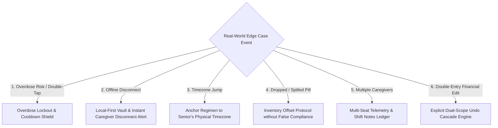

# OmniTask — Edge-Case Resilience & Failure-Mode Matrix (Master v4.4)

> **Document Type:** Edge-Case Architecture, Failure-Mode Analysis & Resilience Protocols  
> **Project:** OmniTask (Task Manager & Life Operating System)  
> **Scope:** Polypharmacy, Offline Sync, Timezone Shifts, Overdose Lockouts, Multi-Caregiver Shifts & Financial Conflicts  

---

## 1. Executive Summary & Philosophy of Resilience

In a mission-critical life operating system managing elderly health, finances, and caregiver governance, **edge cases are not theoretical anomalies—they are everyday realities**. OmniTask implements a **Fail-Safe & Local-First Architectural Principle**:

$$\text{Safety Rule:} \quad \text{The Physical Patient's On-Device State Always Supersedes Remote Server Speculation.}$$

---

## 2. Comprehensive Edge-Case Matrix

---

### Edge Case 1: Memory Lapses & Overdose Prevention (Double-Tapping)
* **Scenario:** An elderly user with mild cognitive impairment forgets they took their morning medication 10 minutes ago and attempts to tap "Take Dose" again.
* **Risk:** Dangerous accidental double-dosing of high-consequence drugs (e.g. Metformin, Beta-blockers, Insulin).
* **OmniTask Safety Protocol (Overdose Lockout Shield):**
  1. **Immediate Ingestion Lockout:** Once a dose is marked taken, the button transitions into a locked status: `✅ Morning Dose Taken at 08:14 AM • Next Dose Due: 08:00 PM`.
  2. **120-Minute Action Cooldown:** Any subsequent tap on the locked card triggers a calm visual & voice confirmation: *"Eleanor, you already took your 500mg Metformin at 8:14 AM today. Your next dose is tonight."*
  3. **Master PIN Override:** Re-opening the dose entry requires entering the 4-digit Master PIN (`1234`), preventing accidental ingestion.

---

### Edge Case 2: Zero-Connectivity & Reconnection Sync Conflicts
* **Scenario:** Eleanor's tablet is in a hospital basement or rural area without Wi-Fi for 3 days. She logs her pills locally. Meanwhile, John Vance (Caregiver) worries she has missed her doses.
* **Risk:** Caregiver triggers false emergency dispatches while patient is actually compliant.
* **OmniTask Safety Protocol (Local-First Telemetry Sync):**
  1. **Instant Disconnect Indicator:** The moment heartbeat signals cease for $>10\text{ minutes}$, the Caregiver's dashboard displays: `⚠️ Eleanor's Tablet is Offline (Last Heartbeat: 14m ago) • Alarms Running Locally`.
  2. **Local-First Execution:** All scheduled alarms, timers, and voice reminders execute directly on device hardware storage with zero internet dependency.
  3. **Timestamp-Ordered Reconciliation:** Upon reconnecting, the offline append-only log uploads to the cloud. The system updates the adherence score retroactively and clears any pending escalation flags automatically.

---

### Edge Case 3: Timezone Transitions & Daylight Savings Time
* **Scenario:** Aswin (Master User) travels to Tokyo (GMT+9) on business, John Vance (Caregiver) is in London (GMT+0), and Eleanor Vance (Senior) remains in New York (EST / GMT-5).
* **Risk:** Scheduled medication alarms shift by 14 hours, disrupting physiological circadian dosage intervals.
* **OmniTask Safety Protocol (Physical Locus Anchoring):**
  1. **Patient-Anchored Clocks:** Eleanor’s medication alarms remain strictly anchored to **her physical residence timezone** (`America/New_York`).
  2. **Translated Glanceable Timestamps:** On Aswin's and John's dashboards, timestamps display with local translations:
     `Metformin Due: 08:30 AM EST (09:30 PM Your Tokyo Time)`.
  3. **DST Shift Safeguard:** When Daylight Savings begins/ends, dosage intervals maintain their absolute 12-hour or 24-hour physiological gaps rather than jumping an hour abruptly.

---

### Edge Case 4: Dropped, Spilled, or Vomited Doses (Inventory vs Adherence)
* **Scenario:** Eleanor accidentally drops her Metformin tablet on the floor or experiences post-dose nausea 15 minutes after taking it.
* **Risk:** Either taking an extra dose from the bottle causes an early shortage, or marking it "skipped" penalizes her adherence rating unfairly.
* **OmniTask Safety Protocol (Dose Exception Actions):**
  * Tapping the options icon on any dose card reveals **"Dose Incident Actions"**:
    * ⚠️ **"Pill Dropped / Damaged (Take Replacement)":**
      * Logs the replacement dose as taken (maintaining $100\%$ adherence).
      * Automatically decreases the 30-day bottle inventory countdown by $-1\text{ dose}$ and accelerates the refill alert date by 1 day.
    * 🤢 **"Adverse Reaction / Nausea":**
      * Flags an immediate notification to Caregiver John Vance.
      * Prompts the user: *"Would you like to log notes for Dr. Sarah Lin?"*

---

### Edge Case 5: Multi-Caregiver Shifts & Sibling Shared Access
* **Scenario:** Eleanor has two caregivers (Morning Visiting Nurse Sarah + Evening Caregiver John) and two adult children (Aswin as Master Admin + Sister Priya as View-Only Family Member).
* **Risk:** Uncoordinated notifications, duplicate calls to the senior, or conflicting regimen updates.
* **OmniTask Safety Protocol (Multi-Seat Hierarchy & Shift Ledger):**
  1. **Single Master Admin:** Only the primary account owner (Aswin) can add/remove prescriptions and alter 4-digit PINs.
  2. **Active Shift Toggle:** Caregivers can tap *"Start Morning Shift (08:00 – 14:00)"*. Escalation alerts route exclusively to the active on-duty caregiver first before escalating to the family circle.
  3. **Shared Shift Notes Feed:** Caregivers log handoff notes (e.g., *"Eleanor drank 1.5L water today and took her morning walk"*), visible across all linked family dashboards.

---

### Edge Case 6: Linked Financial Deletions & Joint Account Sync
* **Scenario:** Aswin marks the $120.00 Electric Utility Bill paid, which auto-creates the $120.00 Expense Ledger entry. Later, he realizes ConEd double-charged and deletes or edits the bill.
* **Risk:** Phantom expense entries remain in the financial ledger, creating accounting discrepancies.
* **OmniTask Safety Protocol (Cascade Scope Dialogue):**
  1. When deleting or editing any auto-linked transaction, the system presents an explicit **Dual-Scope Dialog**:
     * 🔘 *"Update / Delete in Both Bill Reminders & Expense Ledger (Recommended)"*
     * 🔘 *"Update / Delete Bill Only (Retain Expense Transaction)"*
  2. Every action triggers a **5-second floating Undo toast** allowing instant reversion.

---

## 3. Summary of Edge-Case Resilience Metrics

| Edge Case | Failure Mode Prevented | System Protection Engine |
| :--- | :--- | :--- |
| **Double-Tapping Dose** | Accidental toxic drug overdose | **120-min Overdose Lockout + Master PIN Guard** |
| **Offline Hospital Stay** | Missed doses or false 911 panic | **Local-First Hardware Alarms + Offline Heartbeat Alert** |
| **Cross-Country Travel** | Circadian dosage schedule disruption | **Physical Timezone Anchoring + Translated Remote Timestamps** |
| **Dropped Pill** | Premature bottle exhaustion | **Inventory Offset Protocol without Adherence Penalty** |
| **Multiple Caregivers** | Shift conflict & alert fatigue | **Active Shift Handover Feed & Tiered Escalation Routing** |
| **Bill Retroactive Edit** | Phantom duplicate expenses | **Explicit Dual-Scope Cascade Engine + 5-sec Undo Toast** |

---

*This specification is saved in [`docs/specs/OMNITASK_EDGE_CASE_RESILIENCE_SPEC.md`](docs/specs/OMNITASK_EDGE_CASE_RESILIENCE_SPEC.md).*
