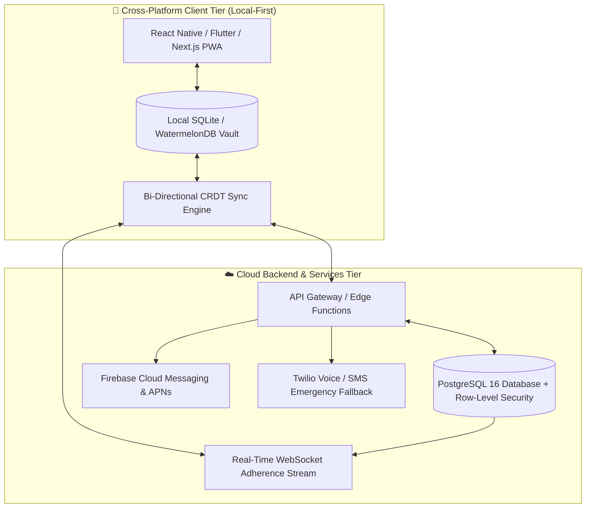
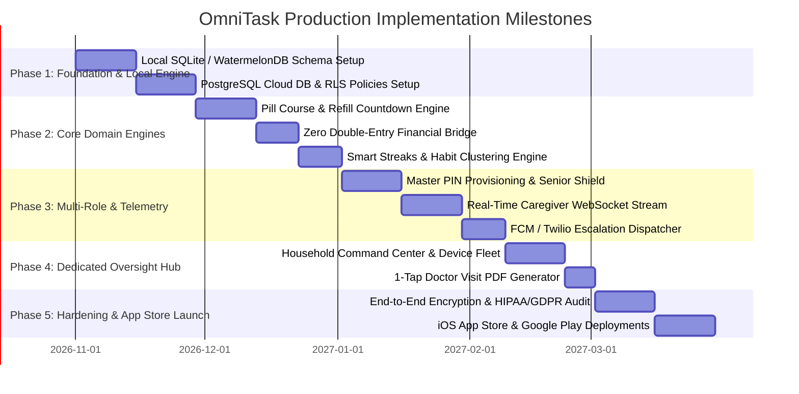

# OmniTask — Full-Stack Production Architecture & Engineering Roadmap (Master v4.4)

> **Document Type:** Production Engineering Blueprint, Database Schema (PostgreSQL DDL), API Contracts & Implementation Roadmap  
> **Project:** OmniTask (Task Manager & Life Operating System)  
> **Target Platforms:** iOS (Apple Store), Android (Google Play), Responsive Desktop Web / PWA  
> **Architecture Pattern:** Local-First Reactive Client + Real-Time Relational Cloud Sync (PostgreSQL + RLS)  

---

## 1. Production Technology Stack Selection



| Architectural Layer | Recommended Technology | Technical Rationale |
| :--- | :--- | :--- |
| **Mobile & Tablet UI** | **Flutter / React Native** | Native performance on iOS/Android, offline hardware alarms, 60fps animations, 56dp senior touch rendering. |
| **Desktop / Web** | **Next.js 15 (React 19) + Tailwind CSS** | Server-side rendering (SSR), high-contrast accessibility compliance, responsive 4-pillar grid. |
| **Local-First Database** | **SQLite / WatermelonDB / PGlite** | Zero-latency instant UI response; all medication alarms and Medical ID cards work offline. |
| **Cloud Database** | **PostgreSQL 16 (Supabase / AWS RDS)** | ACID compliance, JSONB schema support for irregular routines, Row-Level Security (RLS). |
| **Real-Time Telemetry** | **WebSockets / Supabase Realtime** | Sub-100ms adherence status updates between Eleanor's tablet, John's phone, and Aswin's laptop. |
| **Emergency Notifications** | **FCM + APNs + Twilio Voice/SMS** | Multi-channel escalation delivery (Push notification $\rightarrow$ SMS $\rightarrow$ Automated voice call). |

---

## 2. PostgreSQL Relational Database Schema (DDL)

```sql
-- 1. Households Table (Multi-tenant family unit)
CREATE TABLE households (
    id UUID PRIMARY KEY DEFAULT gen_random_uuid(),
    name VARCHAR(100) NOT NULL,
    created_at TIMESTAMP WITH TIME ZONE DEFAULT NOW(),
    updated_at TIMESTAMP WITH TIME ZONE DEFAULT NOW()
);

-- 2. Users Table (Master, Senior, Caregiver accounts)
CREATE TABLE users (
    id UUID PRIMARY KEY DEFAULT gen_random_uuid(),
    household_id UUID REFERENCES households(id) ON DELETE CASCADE,
    email VARCHAR(255) UNIQUE,
    full_name VARCHAR(150) NOT NULL,
    role VARCHAR(20) NOT NULL CHECK (role IN ('master', 'senior', 'caregiver')),
    pin_hash VARCHAR(255), -- 4-Digit Senior PIN (e.g. 1234)
    phone_number VARCHAR(30),
    display_mode VARCHAR(20) DEFAULT 'standard' CHECK (display_mode IN ('standard', 'senior_shield', 'caregiver_telemetry')),
    created_at TIMESTAMP WITH TIME ZONE DEFAULT NOW()
);

-- 3. Medication Regimens Table (Pill Course Progression Engine)
CREATE TABLE medication_regimens (
    id UUID PRIMARY KEY DEFAULT gen_random_uuid(),
    patient_id UUID REFERENCES users(id) ON DELETE CASCADE,
    name VARCHAR(150) NOT NULL,
    dosage VARCHAR(50) NOT NULL, -- e.g. "500mg"
    schedule_times TEXT[] NOT NULL, -- e.g. '{"08:00", "20:00"}'
    regimen_type VARCHAR(20) DEFAULT 'fixed_course' CHECK (regimen_type IN ('fixed_course', 'chronic_ongoing')),
    total_course_days INT DEFAULT 30,
    current_day INT DEFAULT 1,
    inventory_remaining_doses INT NOT NULL,
    refill_warning_days INT DEFAULT 5,
    doctor_name VARCHAR(100),
    doctor_phone VARCHAR(30),
    rx_number VARCHAR(50),
    is_active BOOLEAN DEFAULT TRUE,
    created_at TIMESTAMP WITH TIME ZONE DEFAULT NOW()
);

-- 4. Dose Logs Table (Adherence Telemetry Stream)
CREATE TABLE dose_logs (
    id UUID PRIMARY KEY DEFAULT gen_random_uuid(),
    regimen_id UUID REFERENCES medication_regimens(id) ON DELETE CASCADE,
    patient_id UUID REFERENCES users(id) ON DELETE CASCADE,
    scheduled_at TIMESTAMP WITH TIME ZONE NOT NULL,
    taken_at TIMESTAMP WITH TIME ZONE,
    status VARCHAR(20) DEFAULT 'pending' CHECK (status IN ('pending', 'taken', 'skipped', 'dropped', 'adverse_reaction')),
    notes TEXT,
    created_at TIMESTAMP WITH TIME ZONE DEFAULT NOW()
);

-- 5. Bills & Payments Table (Zero Double-Entry Financial Bridge)
CREATE TABLE bills (
    id UUID PRIMARY KEY DEFAULT gen_random_uuid(),
    household_id UUID REFERENCES households(id) ON DELETE CASCADE,
    title VARCHAR(150) NOT NULL,
    payee VARCHAR(100) NOT NULL,
    amount NUMERIC(10, 2) NOT NULL,
    due_date DATE NOT NULL,
    is_paid BOOLEAN DEFAULT FALSE,
    paid_at TIMESTAMP WITH TIME ZONE,
    is_recurring BOOLEAN DEFAULT TRUE,
    recurrence_rule VARCHAR(50) DEFAULT 'monthly',
    created_at TIMESTAMP WITH TIME ZONE DEFAULT NOW()
);

-- 6. Expense Ledger Table
CREATE TABLE expenses (
    id UUID PRIMARY KEY DEFAULT gen_random_uuid(),
    household_id UUID REFERENCES households(id) ON DELETE CASCADE,
    title VARCHAR(150) NOT NULL,
    amount NUMERIC(10, 2) NOT NULL,
    category VARCHAR(50) NOT NULL, -- e.g. "Bills/Utilities", "Groceries", "Medical"
    transaction_date DATE NOT NULL,
    linked_bill_id UUID REFERENCES bills(id) ON DELETE SET NULL,
    is_family_reimbursable BOOLEAN DEFAULT FALSE,
    created_at TIMESTAMP WITH TIME ZONE DEFAULT NOW()
);

-- 7. Workouts & Smart Streaks Table
CREATE TABLE workouts (
    id UUID PRIMARY KEY DEFAULT gen_random_uuid(),
    user_id UUID REFERENCES users(id) ON DELETE CASCADE,
    title VARCHAR(150) NOT NULL,
    exercises JSONB NOT NULL, -- e.g. [{"name": "Bench Press", "sets": 3, "reps": 10, "weight": 135}]
    completed_at TIMESTAMP WITH TIME ZONE DEFAULT NOW()
);

-- 8. Caregiver Audit Logs Table
CREATE TABLE caregiver_audit_logs (
    id UUID PRIMARY KEY DEFAULT gen_random_uuid(),
    caregiver_id UUID REFERENCES users(id) ON DELETE CASCADE,
    patient_id UUID REFERENCES users(id) ON DELETE CASCADE,
    action_type VARCHAR(50) NOT NULL, -- e.g. 'chart_view', 'note_submitted', 'alert_acknowledged'
    action_payload JSONB,
    created_at TIMESTAMP WITH TIME ZONE DEFAULT NOW()
);

-- 9. Paired Device Fleet & Battery Telemetry
CREATE TABLE device_telemetry (
    id UUID PRIMARY KEY DEFAULT gen_random_uuid(),
    user_id UUID REFERENCES users(id) ON DELETE CASCADE,
    device_model VARCHAR(100) NOT NULL,
    battery_percentage INT CHECK (battery_percentage BETWEEN 0 AND 100),
    is_online BOOLEAN DEFAULT TRUE,
    last_heartbeat TIMESTAMP WITH TIME ZONE DEFAULT NOW()
);
```

---

## 3. Core API Endpoint Contracts

### 3.1 Authentication & Multi-Role Gateway
* `POST /api/v1/auth/login` $\rightarrow$ Authenticate master user or caregiver.
* `POST /api/v1/auth/senior-pin-login` $\rightarrow$ Validate senior 4-digit PIN (`1234`) with instant offline fallback.
* `PUT /api/v1/household/provision-senior-pin` $\rightarrow$ Master User updates Eleanor's PIN with automatic household sync.

### 3.2 Medication & Telemetry APIs
* `POST /api/v1/health/take-dose` $\rightarrow$ Mark dose taken, increment day counter (`Day 18/30`), recalculate adherence score.
* `POST /api/v1/health/dose-incident` $\rightarrow$ Handle dropped pills (inventory $-1$) or adverse reactions without adherence penalty.
* `GET /api/v1/health/export-doctor-summary` $\rightarrow$ Generate streaming 1-page PDF of 30-day compliance.

### 3.3 Financial Bridge APIs
* `POST /api/v1/finance/pay-bill` $\rightarrow$ Mark bill paid, automatically insert linked transaction into `expenses` ledger, recalculate calendar daily spend.
* `PUT /api/v1/finance/cascade-update` $\rightarrow$ Dual-scope update modifying both bill and expense with undo token.

---

## 4. Row-Level Security (RLS) Access Policies

```sql
-- Enable Row-Level Security on all tables
ALTER TABLE medication_regimens ENABLE ROW LEVEL SECURITY;
ALTER TABLE expenses ENABLE ROW LEVEL SECURITY;
ALTER TABLE caregiver_audit_logs ENABLE ROW LEVEL SECURITY;

-- 1. Master User has full access to their household data
CREATE POLICY master_full_access ON medication_regimens
    FOR ALL
    USING (patient_id IN (
        SELECT id FROM users WHERE household_id = (
            SELECT household_id FROM users WHERE id = auth.uid() AND role = 'master'
        )
    ));

-- 2. Caregiver has SELECT-only visibility to assigned patient medications
CREATE POLICY caregiver_medication_read ON medication_regimens
    FOR SELECT
    USING (auth.uid() IN (
        SELECT id FROM users WHERE role = 'caregiver'
    ));

-- 3. Caregivers are STRICTLY FORBIDDEN from viewing financial expenses
CREATE POLICY caregiver_expense_block ON expenses
    FOR ALL
    USING (EXISTS (
        SELECT 1 FROM users WHERE id = auth.uid() AND role IN ('master', 'senior')
    ));
```

---

## 5. Phase-by-Phase Production Roadmap



---

*This specification is saved in [`docs/specs/OMNITASK_FULL_STACK_PRODUCTION_ROADMAP.md`](docs/specs/OMNITASK_FULL_STACK_PRODUCTION_ROADMAP.md).*
