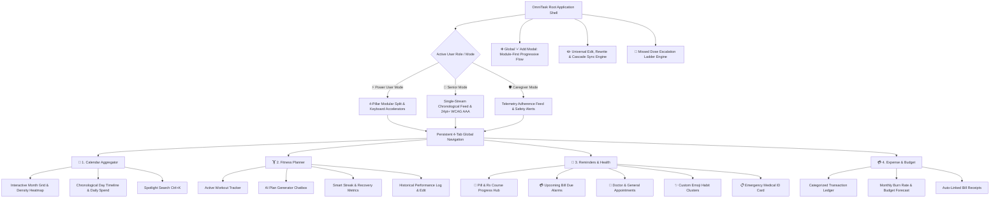
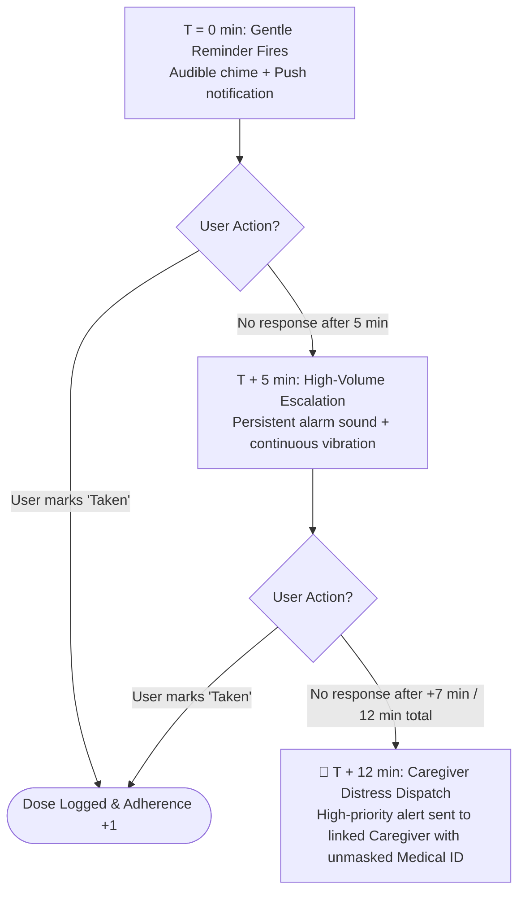
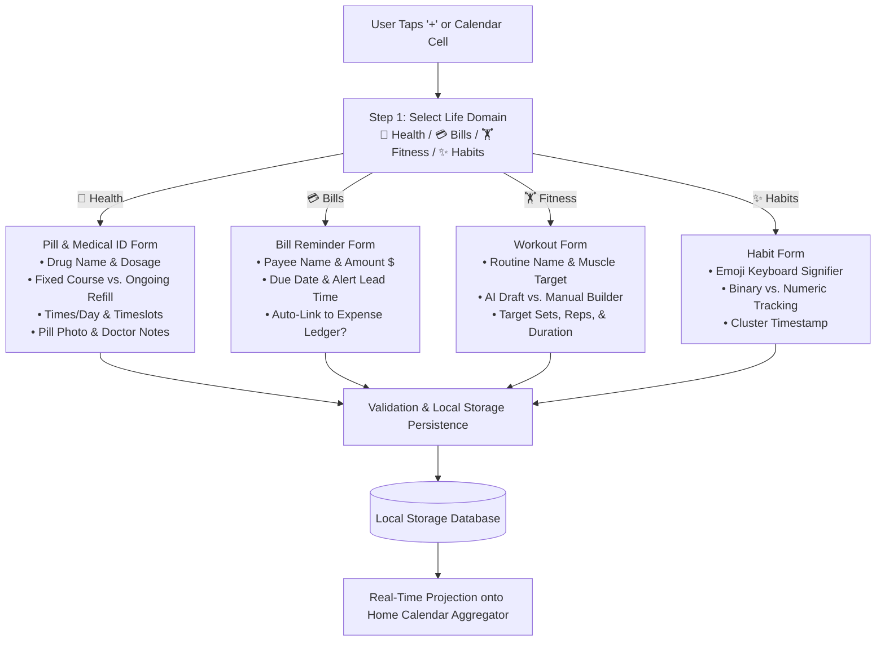
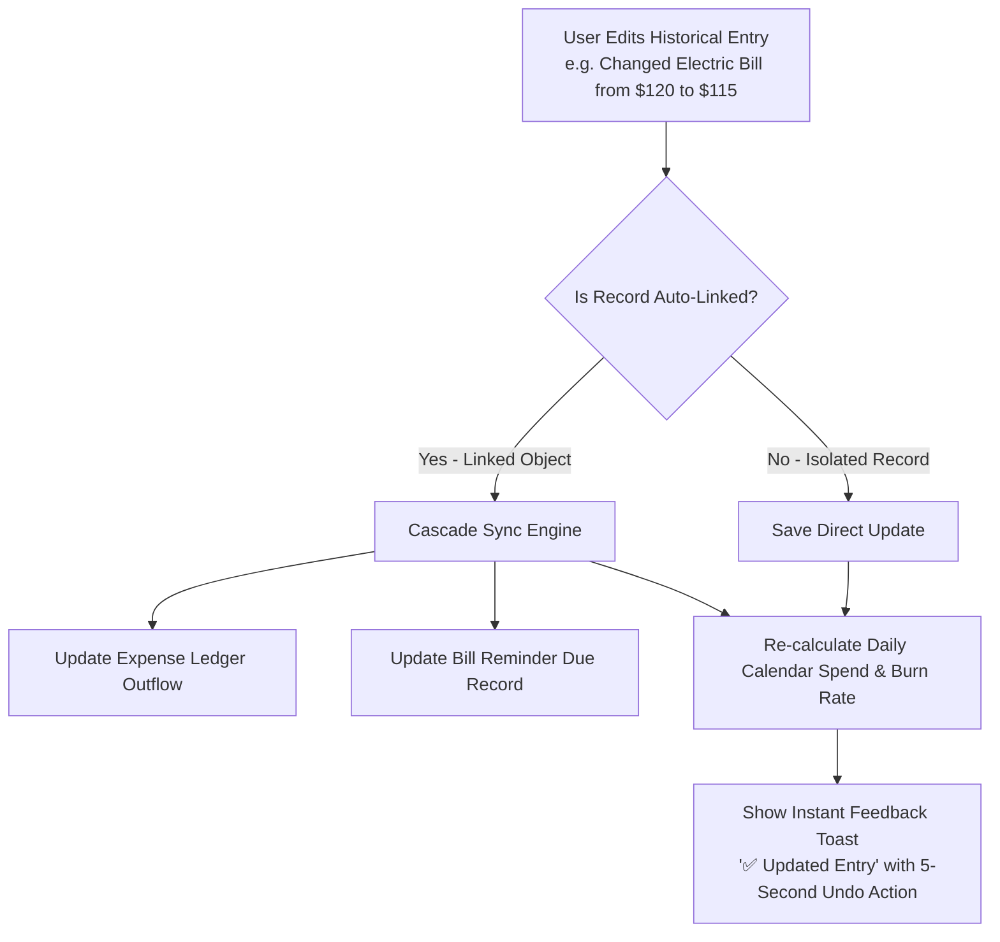
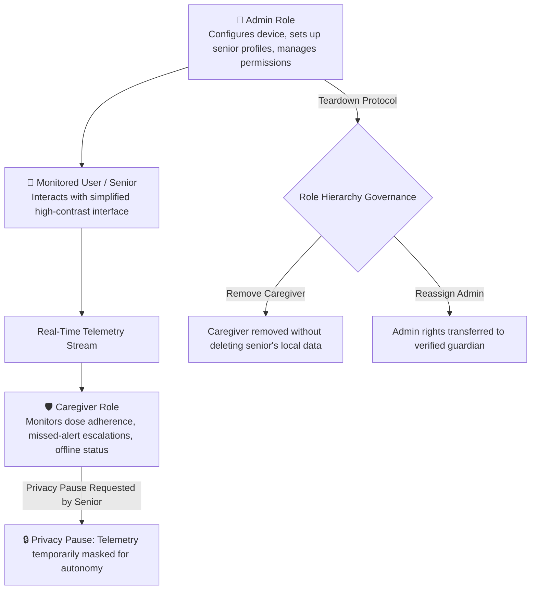

# OmniTask — Complete System Architecture & Product Blueprint (v4.3 Master)

> **Document Classification:** Master Product Architecture, Information Hierarchy, & System Report  
> **Application Name:** OmniTask (Task Manager App) — Calendar-Centric Life Dashboard  
> **Prepared for:** Aswin (`aswin_bd_24_602`)  
> **Version:** 4.3 (Complete Comprehensive Edition with Pill Course Progress, Auto-Link Budgeting, Smart Streaks, & Historical Edit/Rewrite Engine)  
> **Repository:** `https://github.com/aswin1237/task-manager-app-beta`  
> **Deployment Hub:** `https://aswin1237.github.io/task-manager-app-beta/`  

---

## 1. Executive Product Overview & Core Mission

**OmniTask** is a calendar-centric personal operating system designed to bridge the structural divide between **high-velocity productivity tools** (used by professionals and young adults) and **accessible, high-safeguard health/finance interfaces** (essential for seniors, patients, and caregivers).

### The Fundamental Core Premise
> **The Home Calendar is strictly an aggregator and preview engine — it never owns, stores, or duplicates underlying domain data.**

Four specialized, independent life-domain engines feed structured events into this aggregation hub:
1. 🏋️ **Fitness & Physical Health:** Workout logs, AI routines, muscle targeting, and resilient smart streaks.
2. 💊 **Health, Medication & Appointments:** Prescription regimens, visual course progression bars, refill countdowns, Medical ID, and missed-dose escalation ladders.
3. 💳 **Bills & Financial Budgeting:** Prospective bill reminders, categorized expense ledger, auto-linked payments, and real-time monthly burn rate forecasting.
4. ✨ **Personal Habits & Custom Tasks:** Freeform native emoji signifiers, same-day clustering (`🎸 ×3`), and quantitative tracking.

---

## 2. Complete Application Sitemap & Navigation Hierarchy

OmniTask uses a persistent **4-tab bottom navigation** system combined with a global role/density mode switcher:

---

## 3. The 4 Specialized Functional Engines (Deep Dive)

### 3.1 📅 Engine 1: Calendar Aggregator & Unified Timeline
The Home Calendar does not hold proprietary state. It polls the four underlying engines and computes an aggregated view in real time.

* **Month Grid View:** Displays density heatmap indicators for total tasks, color-coded domain dots (💊 Green, 💳 Amber, 🏋️ Blue, ✨ Purple), and daily expenditure totals ($).
* **Day Timeline View:** Chronological schedule organized from 00:00 to 23:59.
* **Single-Tap Inspection:** Tapping any date (e.g. October 18) instantly locks that date across all modules and pre-fills ingestion modals.
* **Non-Duplication Guarantee:** If an item is modified in its native module, the calendar preview automatically reflects the update without data replication.

---

### 3.2 💊 Engine 2: Pill Reminders, Course Progression & Medical ID (v4.3)
Designed with strict clinical and cognitive safeguards:

* **Dual Regimen Classification:**
  1. *Fixed Course:* Temporary medications with a defined lifecycle (e.g. 7-day antibiotic, 14-day post-op regimen, 30-day acute treatment).
  2. *Chronic / Ongoing:* Continuous daily maintenance medications (e.g. daily blood pressure pills) tracked in 30/60/90-day refill batches.
* **Visual Course Progression Bar:**
  * Displays active progress: `Day 18 of 30 Completed (60%) • 12 Days Remaining`.
  * Senior High-Contrast Mode displays large visual pill capsule counters (`🟢 18 DAYS TAKEN • ⚪ 12 DAYS LEFT`).
* **Smart Pharmacy Refill Countdown:**
  * When remaining days drop to $\le 5\text{ days}$ (or $\le 15\%$), a high-priority banner triggers: *"⚠️ Refill needed in 4 days — Tap to call pharmacy or request Rx renewal"*.
* **Course Completion Protocol:**
  * Upon logging the final dose ($30/30$), the system triggers a completion milestone and prompts: *"Archive this medication or schedule follow-up physician consultation?"*
* **Exportable Emergency Medical ID:**
  * Generates an offline-accessible digital emergency card containing drug names, exact dosages, Rx numbers, prescribing doctors, and physical pill photographs.
* **The Missed-Dose Escalation Ladder:**

---

### 3.3 💳 Engine 3: Bills & Financial Budget Ledger (v4.3)
Unifies prospective debt obligations with retrospective cash outflows:

* **The Zero Double-Entry Bridge:**
  * When a user marks a Bill Reminder (e.g. `$120 Electric Bill`) as `Paid`:
  * OmniTask automatically creates a corresponding transaction in the **Expense Ledger** under `Housing & Utilities` with `isAutoLinked: true`.
  * Daily spend on the Calendar Aggregator updates instantly.
* **Categorized Ledger:**
  * 🏠 Housing & Utilities | 🛒 Groceries & Food | 💊 Medical & Pharmacy | 🚗 Transport & Fuel | 🎯 Leisure & Discretionary.
* **Dynamic Monthly Spend Forecast:**
  $$\text{Projected Monthly Spend} = \text{Spent to Date} + \sum (\text{Pending Bills}) + \left(\frac{\text{Discretionary Outflow}}{\text{Days Elapsed}} \times \text{Remaining Days}\right)$$
* **Financial Privacy Controls:**
  * Users can mask dollar values from Caregiver telemetry or protect the Expense tab with biometric/PIN authentication.

---

### 3.4 🏋️ Engine 4: Fitness Planner & Smart Streaks (v4.3)
Balances structured athletic planning with forgiving behavioral psychology:

* **Dual Creation Pathways:**
  1. *AI Conversational Chatbox:* Drafts multi-day progressive overload routines based on user equipment, target muscles, and recovery schedules.
  2. *Manual Exercise Builder:* Custom sets, reps, resistance weight (lbs/kg), and cardio duration.
* **Resilient "Smart Streaks" (Anti-Demotivation Rule):**
  * Traditional habit trackers reset a streak to `0` upon a single missed day, causing the psychological *"what-the-hell effect"*.
  * OmniTask implements **Soft Decay**: Missing a workout decreases streak count by **1 unit** rather than dropping to zero, encouraging immediate resumption.
* **Retroactive Performance Logging & Editing:**
  * Users can adjust historical weights, back-fill completed workouts, and edit exercise metrics retroactively.

---

### 3.5 ✨ Engine 5: Habits & Custom Emoji Tasks (v4.3)
A flexible engine for routines that do not fit rigid categories:

* **Native Keyboard Emoji Signifiers:** Users assign any emoji (`🎸` Guitar, `💧` Water, `📚` Reading, `🧘` Meditation).
* **Same-Day Clustering Architecture:** Multiple tasks sharing the same emoji on a single date do not create cluttered duplicate rows. They collapse into an elegant cluster (`🎸 ×3`) that expands upon inspection.
* **Dual Tracking Modes:**
  1. *Binary Streak:* Yes/No completion.
  2. *Quantitative Volume:* Numeric accumulation (e.g., 2.5 Liters of water, 45 minutes of reading).

---

## 4. The Global Ingestion Architecture (`+` Add Flow)

OmniTask prevents cognitive overload through a **Module-First, 3-Step Progressive Disclosure Hierarchy**:

---

## 5. Universal Edit, Rewrite & Cascade Synchronization Engine

Every record in OmniTask supports full retroactive editing and data rewriting:

### Key Editing Rules:
1. **Pill Regimen Adjustments:** Modifying dosage (e.g. $500\text{mg} \rightarrow 250\text{mg}$) updates future scheduled doses while preserving historical clinical records of past doses taken.
2. **Course Extension:** Adjusting a 30-day course to 45 days instantly recalibrates the visual progress bar and shifts the pharmacy refill alert date.
3. **Fitness Reconciliation:** Historical sets, weights, and timestamps can be corrected retroactively to maintain genuine workout progression graphs.
4. **Undo/Redo System:** System-wide `Ctrl+Z` / `Ctrl+Y` and floating undo action snackbars ensure zero accidental data loss.

---

## 6. Multi-Role Governance, Security, & Teardown Architecture

### Role Authority Matrix:

| Action / Capability | 👤 Monitored User | 🛡️ Caregiver | 🔑 Admin |
| :--- | :---: | :---: | :---: |
| **Mark Daily Pill / Bill Completed** | ✅ Full Access | ✅ Full Access | ✅ Full Access |
| **View Emergency Medical ID** | ✅ Full Access | ✅ Full Access | ✅ Full Access |
| **Receive Missed-Dose Distress Escalations** | ❌ (Target of Alert) | ✅ Real-Time SMS/Push | ✅ Real-Time SMS/Push |
| **Add / Edit / Rewrite Prescriptions** | ✅ Full Access | ⚠️ Requires Confirmation | ✅ Full Access |
| **Mask Financial Balance / PIN Lock** | ✅ Full Access | ❌ Masked by Default | ⚠️ Configurable |
| **Assign / Revoke Caregiver Access** | ❌ Restricted | ❌ Restricted | ✅ Full Authority |

---

## 7. Dual View Modes & Accessibility Matrix

| Architectural Attribute | ⚡ Power User Mode | 👵 Senior Accessible Mode |
| :--- | :--- | :--- |
| **Visual Architecture** | 4-column modular split dashboard | Single-stream chronological feed |
| **Typography Scale** | Compact $12\text{pt} - 14\text{pt}$ JetBrains Mono / Sans | Large $24\text{pt} - 32\text{pt}$ high-legibility bold sans |
| **Color Contrast Ratio** | WCAG AA ($4.5:1$) with dark/light themes | WCAG AAA ($7.0:1$ minimum) ultra-high contrast |
| **Touch Target Size** | $36 \times 36\text{dp}$ dense controls | $56 \times 56\text{dp}$ oversized tap areas |
| **Navigation Complexity** | Keyboard shortcuts (`Ctrl+K`, `Ctrl+Z`), quick filters | 1-Tap simplified confirmation buttons & voice/TTS |
| **Pill Course View** | Detailed percentage bar + pharmacy refill stats | Large visual capsule dots (`🟢 18 TAKEN • ⚪ 12 LEFT`) |

---

## 8. Offline Resilience & Timezone Governance

1. **Local-First Storage:** All schedules, medical records, and financial ledgers reside locally on device storage via `IndexedDB` / `localStorage`. Reminders fire accurately without cellular connectivity.
2. **Instant Offline Telemetry:** When a monitored senior's device drops off the network, the system immediately notifies the caregiver (`"Eleanor's phone is currently offline"`).
3. **Timezone Decoupling:** Regimens run strictly on the monitored user's local timezone, with timestamps automatically converted for remote caregivers.

---

## 9. Comprehensive System Summary Matrix

| Module | Core Purpose | Primary Data Fields | Key Automation / Engine |
| :--- | :--- | :--- | :--- |
| **📅 Calendar Aggregator** | Master preview & timeline | Timestamp, Domain Tag, Density Metric | Real-time cross-domain aggregation |
| **💊 Pill & Health** | Rx adherence & emergency safety | Drug Name, Dosage, Regimen Type, Course Days | Course Progress Bar, Refill Alert, Escalation Ladder |
| **💳 Bills & Budget** | Debt tracking & expense ledger | Payee, Amount ($), Due Date, Category | Zero Double-Entry Bill $\rightarrow$ Expense Auto-Link |
| **🏋️ Fitness** | Workout logs & physical health | Routine, Muscle Target, Sets, Reps, Weight | AI Routine Generator, Resilient Smart Streaks |
| **✨ Habits & Tasks** | Daily recurring routines | Emoji Signifier, Tracking Mode, Cluster Time | Same-Day Emoji Clustering (`🎸 ×3`) |
| **✏️ Edit & Rewrite** | Error recovery & historical audits | Target Object ID, Modified Fields, Sync Flags | Cascade Sync across linked entries with Undo/Redo |
| **🛡️ Governance** | Safety & multi-user care | Role IDs, Adherence Score, Telemetry Token | Privacy Pause & Caregiver Emergency Escalation |

---

*This document represents the master product blueprint for OmniTask v4.3 and serves as the definitive reference specification for development, design, and usability evaluations.*
